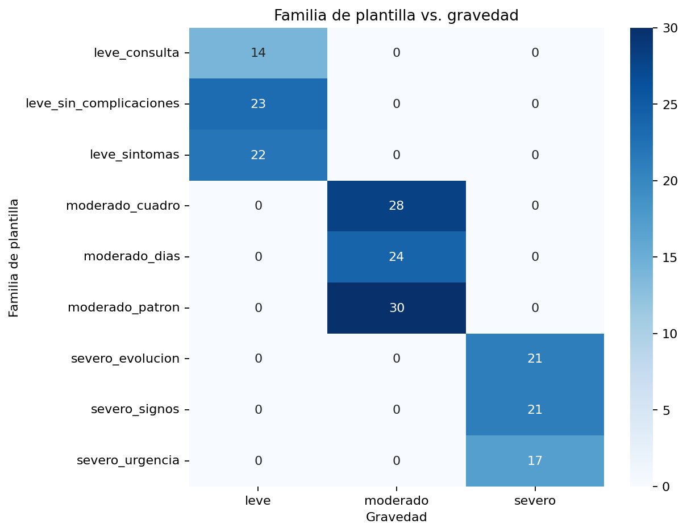
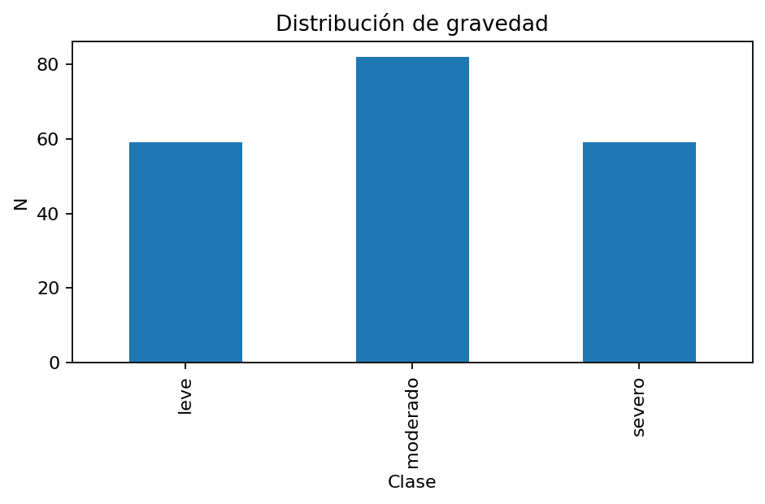
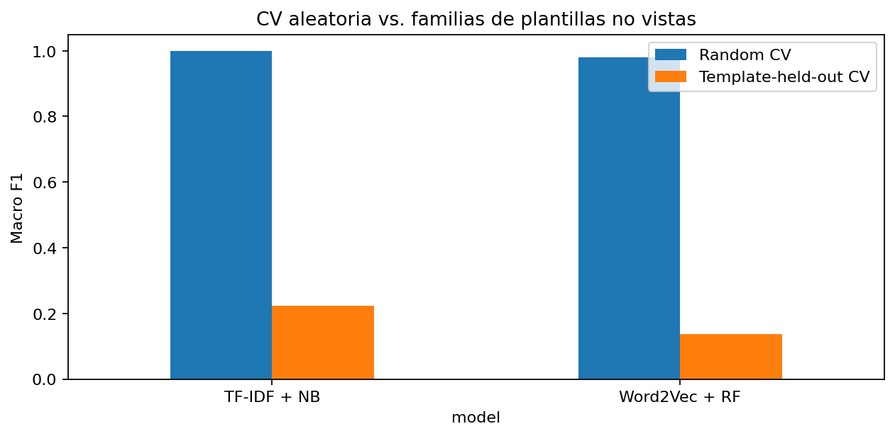
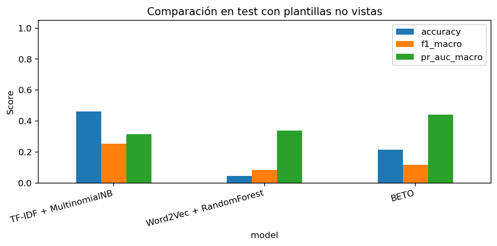
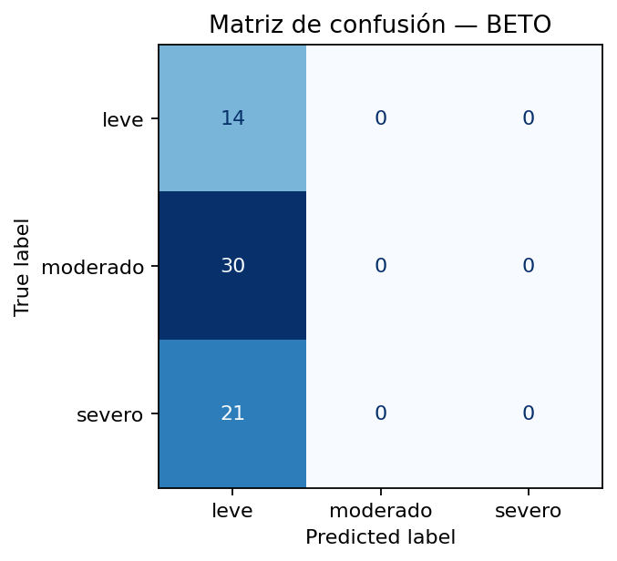
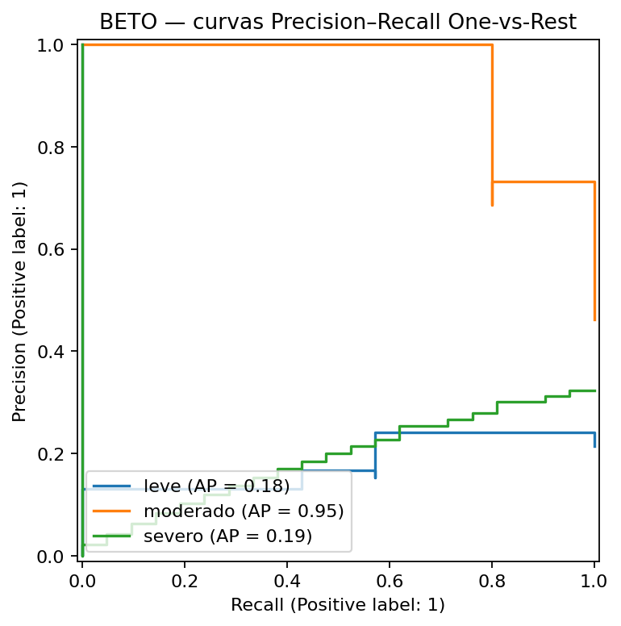
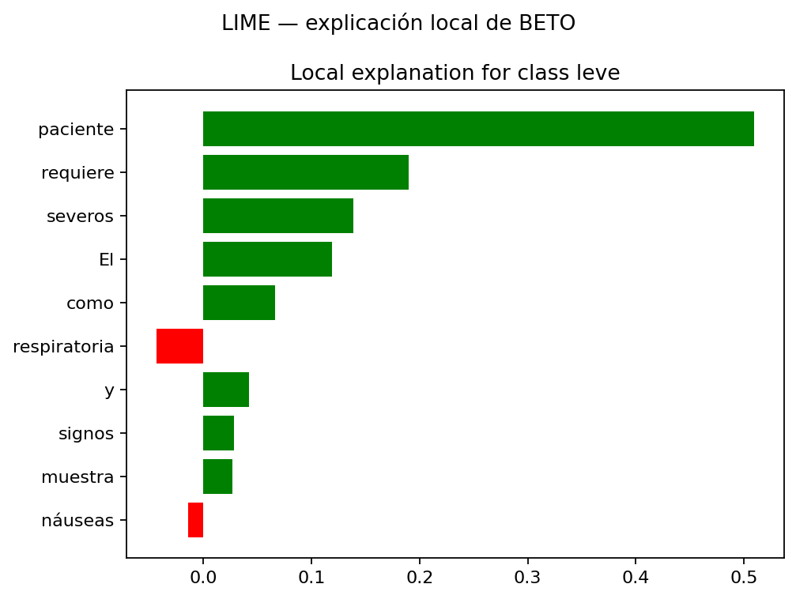
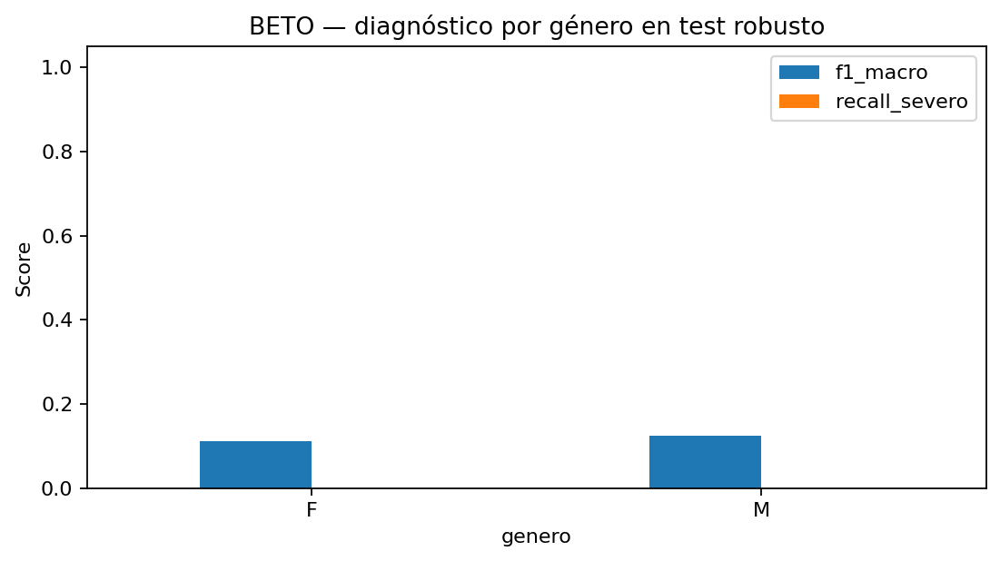

# Clasificación de Notas Clínicas con BETO

Proyecto de **NLP en español** sobre notas clínicas **simuladas**, profesionalizado con foco en validación robusta, detección de shortcuts, explicabilidad y análisis ético.

[](https://github.com/Koke-Oliva/nlp-notas-clinicas-bert/actions/workflows/notebook-ci.yml)
[](https://www.python.org/)
[](https://www.tensorflow.org/)
[](https://huggingface.co/)
[](https://colab.research.google.com/github/Koke-Oliva/nlp-notas-clinicas-bert/blob/main/nlp-notas-clinicas-bert.ipynb)
[](https://nbviewer.org/github/Koke-Oliva/nlp-notas-clinicas-bert/blob/main/nlp-notas-clinicas-bert.ipynb)

## Vista rápida

- **Problema:** clasificación multiclase de gravedad simulada: `leve`, `moderado`, `severo`.
- **Modelos:** TF-IDF + Multinomial Naive Bayes, Word2Vec + Random Forest y BETO.
- **Hallazgo principal:** una CV aleatoria produce Macro F1 de **1.0000** con TF-IDF+NB y **0.9789** con Word2Vec+RF, pero al retener familias completas de plantillas cae a **0.2236** y **0.1365**, respectivamente.
- **Data audit:** 115 textos únicos en 200 filas; 85 repeticiones; en el split aleatorio original, **23/40 textos de test (57,5%)** ya aparecen en train.
- **Target proxy:** usar solo `afeccion` alcanza **Macro F1 = 1.00** en CV aleatoria.
- **BETO robusto:** Macro F1 **0.1181** en el holdout con plantillas no vistas y **recall de severo = 0.00**.
- **Explicabilidad:** LIME sobre un falso negativo de `severo`.
- **Reproducibilidad:** el notebook completo se ejecuta en GitHub Actions y regenera las figuras.

> **Proyecto demostrativo de portafolio.** El dataset es sintético. Este repositorio no representa un sistema clínico y no debe utilizarse para decisiones sobre pacientes.

## El problema detrás del 100%

La entrega académica original obtuvo métricas perfectas con Word2Vec + Random Forest y BETO. En vez de presentar ese `1.00` como evidencia de generalización, esta versión investiga por qué ocurre.

La auditoría encontró tres mecanismos que inflan una evaluación aleatoria:

1. **Textos repetidos:** 85 filas repiten una nota clínica observada previamente.
2. **Afección como proxy:** las 12 afecciones aparecen asociadas a una sola gravedad.
3. **Plantillas deterministas:** las nueve familias de redacción están asociadas a una única clase.



Por tanto, la pregunta principal cambia de “¿qué modelo obtiene mayor accuracy?” a:

> **¿Cuánto del rendimiento se mantiene cuando el modelo recibe estructuras lingüísticas que no vio durante el entrenamiento?**

## Dataset

`data/dataset_clinico_simulado_200.csv` contiene:

- **200** registros sintéticos;
- **115** textos clínicos únicos;
- 59 casos `leve`;
- 82 `moderado`;
- 59 `severo`;
- edad y género simulados;
- afección asociada.



El archivo se incluye para reproducibilidad. Su procedencia y advertencias están documentadas en `data/README.md`.

## Metodología

1. EDA visual y controles de calidad.
2. Auditoría de duplicados exactos.
3. Auditoría de `afeccion` como proxy del target.
4. Identificación de nueve familias de plantillas.
5. spaCy: tokenización, lematización y eliminación de stopwords.
6. **TF-IDF + Multinomial Naive Bayes**.
7. **Word2Vec + Random Forest**.
8. **BETO** (`dccuchile/bert-base-spanish-wwm-uncased`).
9. CV aleatoria estratificada.
10. CV agrupada en tres folds: cada fold retiene una familia completa de cada clase.
11. Holdout robusto común para comparar los tres modelos.
12. BETO con train / validation / test separados.
13. Matrices de confusión y curvas Precision–Recall.
14. Análisis de errores, con foco en falsos negativos de `severo`.
15. Auditoría descriptiva por género y edad.
16. Explicabilidad local con LIME.

### Prevención de leakage

- El test de BETO **no se utiliza como validation** ni controla EarlyStopping.
- El holdout robusto contiene tres familias de plantillas que no aparecen en desarrollo.
- Train y validation de BETO no comparten textos exactos.
- Word2Vec se entrena desde cero dentro de cada fold.
- `afeccion`, género y edad se excluyen de los predictores principales.

## Validación: el resultado importante

| Modelo | Macro F1 — CV aleatoria | Macro F1 — templates no vistos |
|---|---:|---:|
| TF-IDF + Naive Bayes | **1.0000** | **0.2236** |
| Word2Vec + Random Forest | **0.9789** | **0.1365** |



La caída no se interpreta como un defecto del experimento: es el **hallazgo metodológico central**. Los modelos aprenden con facilidad los patrones del generador sintético, pero generalizan mal cuando cambia la estructura de redacción.

## Comparación en el holdout robusto

El holdout común contiene 65 registros y retiene:

- `leve_consulta`;
- `moderado_patron`;
- `severo_signos`.

| Modelo | Accuracy | Precision macro | Recall macro | Macro F1 | PR-AUC macro | Tiempo entrenamiento* |
|---|---:|---:|---:|---:|---:|---:|
| TF-IDF + MultinomialNB | **0.4615** | 0.2041 | 0.3333 | **0.2532** | 0.3162 | ~0.004 s |
| BETO | 0.2154 | 0.0718 | 0.3333 | 0.1181 | **0.4402** | ~132 s |
| Word2Vec + Random Forest | 0.0462 | **0.3333** | 0.0476 | 0.0833 | 0.3392 | ~1.18 s |

*Tiempo observado en una ejecución de GitHub Actions; no es un benchmark universal.



### Qué ocurrió con BETO

En el test robusto BETO predijo los 65 casos como `leve`:

- recall `leve`: **1.00**;
- recall `moderado`: **0.00**;
- recall `severo`: **0.00**;
- falsos negativos de `severo`: **21/21**.



Esto invalida cualquier conclusión de “rendimiento clínico” basada en el 100% del split aleatorio original.

## Precision–Recall



BETO obtiene PR-AUC macro de **0.4402**, pero su regla de decisión colapsa en el holdout de plantillas no vistas. El proyecto distingue explícitamente entre capacidad de ranking probabilístico y clasificación final.

## Explicabilidad con LIME

Se prioriza un **falso negativo de severo**:

> “El paciente muestra signos severos como náuseas y dificultad respiratoria, requiere hospitalización.”

- clase real: `severo`;
- predicción BETO: `leve`;
- confianza: **0.9138**.



La explicación local permite inspeccionar qué tokens sostienen una decisión errónea. LIME describe el comportamiento local del modelo; **no demuestra causalidad ni valida clínicamente la predicción**.

## Género, edad y ética

Género y edad se utilizan como variables de auditoría, no como features de los modelos principales.

En el holdout robusto, BETO obtiene recall de `severo = 0.00` tanto para F como para M y en todos los tramos etarios. Por tanto, **no tiene sentido interpretar pequeñas diferencias de F1 como evidencia de fairness**: el problema prioritario es que el modelo no generaliza.



El proyecto adopta esta regla:

> primero demostrar desempeño mínimamente robusto; después interpretar brechas entre subgrupos.

## Reproducibilidad

GitHub Actions instala dependencias, descarga el modelo spaCy, ejecuta el notebook de principio a fin, descarga BETO desde Hugging Face y regenera todas las figuras.

```bash
git clone https://github.com/Koke-Oliva/nlp-notas-clinicas-bert.git
cd nlp-notas-clinicas-bert

python -m venv .venv

# Linux/macOS
source .venv/bin/activate

# Windows PowerShell
# .venv\Scripts\Activate.ps1

pip install -r requirements.txt
python -m spacy download es_core_news_sm

jupyter notebook nlp-notas-clinicas-bert.ipynb
```

## Estructura

```text
.
├── .github/
│   └── workflows/
│       └── notebook-ci.yml
├── data/
│   ├── README.md
│   └── dataset_clinico_simulado_200.csv
├── figures/
│   ├── beto_pr_curves.png
│   ├── class_distribution.png
│   ├── confusion_beto.png
│   ├── confusion_tfidf.png
│   ├── confusion_w2v.png
│   ├── gender_by_class.png
│   ├── lime_beto.png
│   ├── model_comparison.png
│   ├── subgroup_beto.png
│   ├── template_target_heatmap.png
│   └── validation_gap.png
├── nlp-notas-clinicas-bert.ipynb
├── requirements.txt
├── .gitignore
├── LICENSE
└── README.md
```

## Limitaciones

- Dataset sintético de solo 200 observaciones.
- Fuerte dependencia entre plantillas, afecciones y target.
- Solo una ejecución robusta de BETO en el holdout común; los modelos clásicos sí se evalúan sobre los tres folds agrupados.
- El corpus no representa diversidad lingüística ni epidemiológica real.
- La auditoría de subgrupos tiene soporte pequeño y no constituye una evaluación clínica de fairness.
- LIME es local y aproximado.
- Una aplicación real requeriría datos clínicos gobernados, validación externa y temporal, revisión médica, calibración, privacidad, monitoreo y supervisión humana.

## Contexto académico

Proyecto desarrollado inicialmente en el **Módulo 8 — Procesamiento del Lenguaje Natural** de la Especialización en Machine Learning de IT Academy / Kibernum.

La pauta original pedía preprocesamiento NLP, TF-IDF/embeddings, comparación de modelos, análisis de sesgos y explicabilidad. La versión actual conserva ese objetivo y transforma un resultado académico perfecto en un estudio más riguroso de **generalización, shortcut learning, reproducibilidad y riesgo de modelo**.
